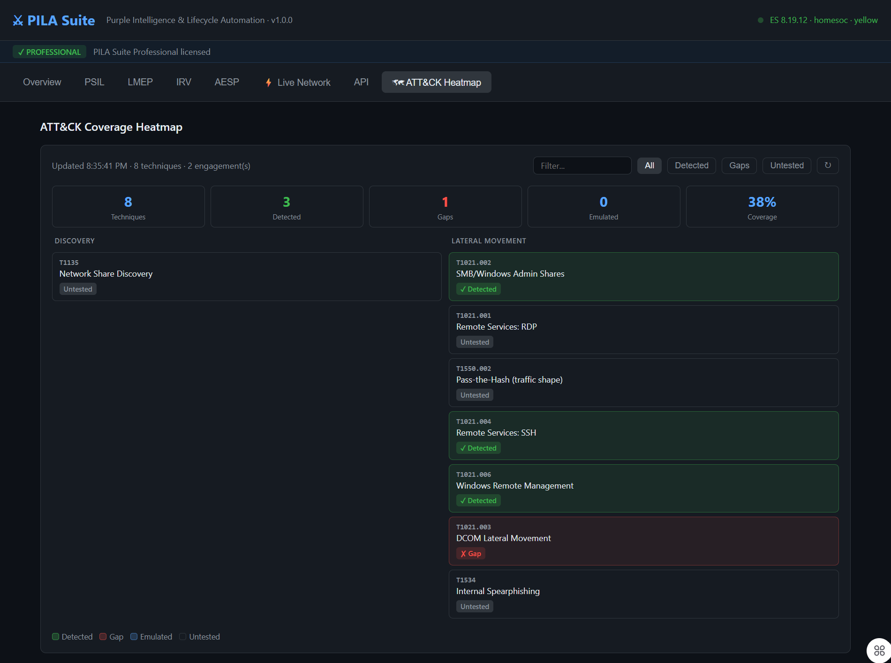

# PILA Suite v1.0.0

**Purple Intelligence & Lifecycle Automation**

Purple team engagements produce detection data that lives in PowerPoint decks and PDF reports. It never gets structured, scored, or tracked over time. PILA Suite fixes that — a unified platform that automates the full purple team engagement lifecycle from scenario planning through adversary emulation, incident validation, and quantitative scoring, backed by live Elasticsearch telemetry from your production security stack.

Deploy it in your SOC, your MSSP environment, your red team infrastructure, or your lab. PILA Suite connects to your existing Elasticsearch, Suricata, and Zeek stack and starts measuring what your detection program actually catches — and what it misses.

---



*Live ATT&CK coverage heatmap — green = detected, red = gap, grey = untested. Pulls from real Suricata/Zeek detection data via your Elasticsearch stack.*

---

## What It Does

Most purple team tooling handles one part of the workflow. PILA Suite handles the whole thing:

| Module | Full Name | What It Does |
|--------|-----------|--------------|
| **PSIL** | Purple Structured Intelligence Language | Structured engagement documentation with ATT&CK mappings, TLP markings, and machine-readable scenario capture |
| **LMEP** | Lateral Movement Emulation Proxy | Safe behavioral technique emulation with live Elasticsearch correlation against your Suricata/Zeek stack |
| **IRV** | Incident Remediation Validator | Post-remediation validation — queries live ES data to confirm hosts are clean before issuing cryptographically signed evidence bundles |
| **AESP** | Attack Effectiveness Scoring Platform | Quantitative scoring (ES 0–100, DMT-1 through DMT-5) derived from real detection outcomes |

---

## Community vs Professional

| Feature | Community | Professional |
|---------|-----------|--------------|
| PSIL engagement creation | ✓ | ✓ |
| AESP basic scoring | ✓ | ✓ |
| ATT&CK heatmap | — | ✓ |
| LMEP emulation (all techniques) | — | ✓ |
| IRV incident validation | — | ✓ |
| Live ES correlation | — | ✓ |
| AESP score history & trending | — | ✓ |
| Report generation | — | ✓ |

Community tier is free. Professional is $99/month — see [pilasuit.com](https://pilasuit.com) for licensing.

---

## Requirements

- Python 3.11+
- Elasticsearch 8.x with Filebeat shipping Suricata alerts
- Suricata 6.x+ (or Zeek) monitoring your network segment
- Linux host (Ubuntu 22.04/24.04 recommended) — bare metal, VM, or cloud instance

---

## Quick Start

```bash
# Clone
git clone https://github.com/nonducorduco311-cyber/pila-suite.git
cd pila-suite

# Configure
cp integrations/pila.conf.example integrations/pila.conf
nano integrations/pila.conf   # Add your ES credentials

# Install and start
./start.sh

# Open dashboard
open http://localhost:8000/

# API docs
open http://localhost:8000/docs
```

---

## Activating a Professional License

```bash
# Run the activation script with your license key
python3 activate.py PILA-XXXX-XXXX-XXXX-XXXX
```

The script validates your key against the license server, writes it to `pila.conf`, and restarts PILA Suite automatically. Purchase a license at [pilasuit.com](https://pilasuit.com).

---

## Deployment

PILA Suite runs anywhere you have Python 3.11+ and an Elasticsearch 8.x instance receiving Suricata or Zeek data. Typical deployments:

| Environment | Description |
|-------------|-------------|
| **SOC / Enterprise** | Deploy on a dedicated Linux host inside your network. Point at your existing ELK stack. |
| **MSSP** | Run one instance per client environment. Each connects to that client's Elasticsearch. |
| **Red/Purple Team** | Deploy alongside your engagement infrastructure. Automate scoring and reporting across engagements. |
| **Home Lab** | Run on bare metal or any hypervisor (Proxmox, VMware, VirtualBox). Full functionality on a single machine with 16GB+ RAM. |

**Minimum infrastructure:** PILA Suite + Elasticsearch + Filebeat + Suricata. Everything else (Zeek, Kibana, ElastAlert) is optional and additive.

---

## AESP Scoring Formula

```
ES = (DE × 0.30) + (RS × 0.20) + (PR × 0.20) + (CB × 0.15) + (RQ × 0.15)
```

| Sub-Score | Weight | Measures |
|-----------|--------|----------|
| DE — Detection Efficacy | 30% | Weighted detection rate by severity |
| RS — Response Speed | 20% | MTTR vs. industry baseline |
| PR — Prevention Rate | 20% | Fraction fully prevented/blocked |
| CB — Coverage Breadth | 15% | ATT&CK tactic + technique coverage |
| RQ — Remediation Quality | 15% | Verification status of gap closures |

| DMT Tier | ES Range | Label |
|----------|----------|-------|
| DMT-5 | 85–100 | Optimized |
| DMT-4 | 70–84 | Advanced |
| DMT-3 | 55–69 | Defined |
| DMT-2 | 40–54 | Developing |
| DMT-1 | 0–39 | Reactive |

---

## LMEP Techniques (v1.0)

| Technique ID | Name | Tier |
|-------------|------|------|
| T1021.001 | Remote Services: RDP | Community |
| T1021.002 | SMB/Windows Admin Shares | Community |
| T1021.003 | DCOM Lateral Movement | Community |
| T1021.004 | Remote Services: SSH | Community |
| T1021.006 | Windows Remote Management | Community |
| T1135 | Network Share Discovery | Community |
| T1534 | Internal Spearphishing | Community |
| T1550.002 | Pass-the-Hash (traffic shape) | Professional |

---

## LMEP Safety Guarantees

1. **No Payload Execution** — behavioral signatures only; no real attack payloads
2. **Passive by Default** — no packet injection without explicit SEMI_ACTIVE mode
3. **Credential Isolation** — SYNTHETIC mode by default; no real credentials required
4. **Full Audit Trail** — all emulation actions logged with timestamps and scope

---

## Project Structure

```
pila-suite/
├── api/
│   └── server.py            # Unified FastAPI server + dashboard UI
├── psil/psil_sdk/           # PSIL engagement data model + validator
├── aesp/aesp_score/         # AESP scoring engine
├── irv/irv_core/            # IRV orchestration + evidence packaging
├── lmep/lmep_core/          # LMEP technique library + session management
├── integrations/
│   ├── elastic_client.py    # Elasticsearch query layer
│   ├── config.py            # Config loader
│   └── pila.conf.example    # Config template (copy to pila.conf)
├── shared/
│   └── license_check.py     # License validation client
├── activate.py              # Customer license activation script
├── start.sh                 # Start PILA Suite
└── stop.sh                  # Stop PILA Suite
```

---

## API Reference

### PSIL
| Method | Path | Tier |
|--------|------|------|
| POST | `/psil/engagements` | Community |
| GET | `/psil/engagements` | Community |
| POST | `/psil/engagements/{id}/scenarios` | Community |
| POST | `/psil/validate/{id}` | Community |

### AESP
| Method | Path | Tier |
|--------|------|------|
| POST | `/aesp/score` | Community |
| GET | `/aesp/score/{id}` | Community |
| GET | `/aesp/history/{id}` | Professional |

### IRV
| Method | Path | Tier |
|--------|------|------|
| POST | `/irv/validate` | Professional |
| GET | `/irv/jobs` | Professional |
| GET | `/irv/incident-types` | Community |

### LMEP
| Method | Path | Tier |
|--------|------|------|
| POST | `/lmep/sessions` | Professional |
| POST | `/lmep/sessions/{id}/run` | Professional |
| GET | `/lmep/techniques` | Community |

### Integrations
| Method | Path | Tier |
|--------|------|------|
| GET | `/integrations/status` | Community |
| GET | `/integrations/suricata/alerts` | Professional |
| GET | `/integrations/zeek/connections` | Professional |
| POST | `/integrations/irv/host-check` | Professional |

### Platform
| Method | Path | Tier |
|--------|------|------|
| GET | `/health` | Community |
| GET | `/license` | Community |
| GET | `/docs` | Community |

---

## License

**Open Core** — PSIL SDK, AESP scoring engine, IRV core playbooks, and LMEP OSS technique library are Apache 2.0.

Full platform features (ATT&CK heatmap, live ES correlation, report generation, IRV validation) require a Professional license.

© 2026 ByTE X Bit Technologies LLC — PILA Suite v1.0.0
